<!-- ================================================================= -->
<!-- ⚡ YUNUS EMRE KURU // CYBER TURQUOISE GITHUB PROFILE ⚡           -->
<!-- Palette: Neon Cyan (#00f5d4), Electric Blue (#00f2fe), Void (#0a0f1d) -->
<!-- ================================================================= -->

<div align="center">

  <!-- HERO BANNER -->
  

  <br/><br/>

  <!-- DYNAMIC TYPING SVG -->
  <a href="https://github.com/yunusemrekuru">
    
  </a>

  <br/>

  <!-- CANLI STATÜ VE METRİK ROZETLERİ -->
  <p align="center">
    
    
    
    
  </p>

  <!-- SOSYAL MEDYA & İLETİŞİM HAPLARI -->
  <p align="center">
    <a href="https://www.linkedin.com/in/yunus-emre-kuru-436b52237/" target="_blank">
      
    </a>
    &nbsp;
    <a href="https://www.instagram.com/kurudevworks" target="_blank">
      
    </a>
    &nbsp;
    <a href="mailto:yunusemrekuru35@gmail.com">
      
    </a>
    &nbsp;
    <a href="https://github.com/yunusemrekuru">
      
    </a>
  </p>

</div>

<br/>

<!-- ================================================================= -->
<!-- 🖥️ TERMINAL HUD // HAKKIMDA                                      -->
<!-- ================================================================= -->

<div align="center">
  <h2>&nbsp; TERMINAL HUD // PROFILE OVERVIEW</h2>
</div>

```typescript
/**
 * @name Yunus Emre Kuru
 * @role Full-Stack Software Developer | Mobile & Web Application Development
 * @brand @kurudevworks
 */

const developer: DeveloperProfile = {
  name: "Yunus Emre Kuru",
  title: "Full-Stack Software Developer",
  focusAreas: [
    "Cross-Platform Mobile Development (Flutter & Dart)",
    "Modern Full-Stack Web Architectures (PHP, Python, JS/TS)",
    "Cloud & BaaS Integration (Supabase, Firebase)",
    "Computer Vision & Deep Machine Learning (OpenCV, YOLO, Random Forest)"
  ],
  engineeringPrinciples: [
    "Pixel-perfect, fluid user interfaces",
    "Clean, maintainable, production-ready codebases",
    "Robust API and real-time database architectures"
  ],
  motto: "Building seamless digital bridges between ideas, screens, and scalable cloud backends."
};
```

<br/>

<!-- ================================================================= -->
<!-- ⚡ TECH STACK & ARSENAL                                          -->
<!-- ================================================================= -->

<div align="center">
  <h2>&nbsp; WEAPONS OF CHOICE // TECH ARSENAL</h2>
  <p><i>Mobil geliştirme, modern web ekosistemleri, yapay zeka & veri bilimi araçları</i></p>
</div>

<br/>

<table align="center" width="100%">
  <tr>
    <td width="50%" valign="top">
      <h3 align="center">📱 Mobile & Cross-Platform</h3>
      <div align="center">
        
      </div>
      <p align="center"><i>Flutter & Dart ile akıcı, yerel performanslı iOS & Android uygulamaları</i></p>
    </td>
    <td width="50%" valign="top">
      <h3 align="center">🌐 Frontend & Web</h3>
      <div align="center">
        
      </div>
      <p align="center"><i>Modern, responsive ve yüksek estetik standartlı kullanıcı arayüzleri</i></p>
    </td>
  </tr>
  <tr>
    <td width="50%" valign="top">
      <h3 align="center">⚙️ Backend & Languages</h3>
      <div align="center">
        
      </div>
      <p align="center"><i>Python, PHP, Node.js ve C# ile ölçeklenebilir arka uç servisleri</i></p>
    </td>
    <td width="50%" valign="top">
      <h3 align="center">🗄️ Cloud, BaaS & Databases</h3>
      <div align="center">
        
      </div>
      <p align="center"><i>Supabase, Firebase, MySQL ve PostgreSQL ile gerçek zamanlı veri altyapısı</i></p>
    </td>
  </tr>
  <tr>
    <td colspan="2" align="center" valign="top">
      <h3 align="center">🧠 AI, Computer Vision & Development Tools</h3>
      <div align="center">
        
      </div>
      <p align="center"><i>OpenCV ile bilgisayarlı görü modelleri, Git versiyon kontrolü ve modern iş akışları</i></p>
    </td>
  </tr>
</table>

<br/>

<!-- ================================================================= -->
<!-- 📊 GITHUB LIVE STATS & STREAKS                                    -->
<!-- ================================================================= -->

<div align="center">
  <h2>&nbsp; SYSTEM METRICS // GITHUB ANALYTICS</h2>
  <p><i>Canlı katkı grafiği, commit serileri ve kod istatistikleri</i></p>

  <br/>

  <!-- Stats Grid -->
  <table align="center" border="0">
    <tr>
      <td>
        <a href="https://github.com/yunusemrekuru">
          
        </a>
      </td>
      <td>
        <a href="https://github.com/yunusemrekuru">
          
        </a>
      </td>
    </tr>
  </table>

  <br/>

  <!-- Top Languages Bar -->
  <a href="https://github.com/yunusemrekuru">
    
  </a>

</div>

<br/><br/>

<!-- ================================================================= -->
<!-- 🚀 FEATURED PROJECTS SHOWCASE                                    -->
<!-- ================================================================= -->

<div align="center">
  <h2>&nbsp; FEATURED BUILDS // HIGHLIGHTS</h2>
  <p><i>Açık kaynak projelerim, makine öğrenmesi laboratuvarları ve mobil çözümler</i></p>
</div>

<br/>

<table align="center" width="100%">
  <tr>
    <td width="50%" valign="top">
      <h3>👁️ <a href="https://github.com/yunusemrekuru/Goruntu-isleme-lab">Goruntu-isleme-lab</a></h3>
      <p>OpenCV ile Bilgisayarlı Görü ders notları ve laboratuvarı: 40+ Jupyter Notebook ile nesne algılama, yüz tanıma, YOLO modelleri, OCR ve video işleme pratikleri.</p>
      <p>
        
        
        
      </p>
      <a href="https://github.com/yunusemrekuru/Goruntu-isleme-lab"><b>GitHub Deposunu İncele &rarr;</b></a>
    </td>
    <td width="50%" valign="top">
      <h3>🎗️ <a href="https://github.com/yunusemrekuru/Breast-Cancer-Prediction-With-Machine-Learning--Random-Forest-">Breast Cancer ML Prediction</a></h3>
      <p>Meme kanseri erken teşhisi için Random Forest (Rastgele Orman) algoritması kullanılarak geliştirilmiş yüksek doğruluk oranlı makine öğrenmesi tahmin modeli.</p>
      <p>
        
        
        
      </p>
      <a href="https://github.com/yunusemrekuru/Breast-Cancer-Prediction-With-Machine-Learning--Random-Forest-"><b>GitHub Deposunu İncele &rarr;</b></a>
    </td>
  </tr>
  <tr>
    <td width="50%" valign="top">
      <h3>📱 <a href="https://www.instagram.com/kurudevworks">Mobile & Full-Stack Apps (@kurudevworks)</a></h3>
      <p>Flutter ile iOS ve Android platformları için modern, akıcı ve yüksek performanslı mobil uygulamalar; Supabase ve Firebase gerçek zamanlı veritabanı entegrasyonları.</p>
      <p>
        
        
        
      </p>
      <a href="https://www.instagram.com/kurudevworks"><b>Instagram'da İncele &rarr;</b></a>
    </td>
    <td width="50%" valign="top">
      <h3>⚙️ <a href="https://github.com/yunusemrekuru/C_Sharp">C_Sharp Enterprise & Algorithms</a></h3>
      <p>C# ve .NET ekosistemi üzerinde geliştirilmiş nesne yönelimli programlama pratikleri, veri yapıları, algoritmik çözümler ve mimari desenler.</p>
      <p>
        
        
        
      </p>
      <a href="https://github.com/yunusemrekuru/C_Sharp"><b>GitHub Deposunu İncele &rarr;</b></a>
    </td>
  </tr>
</table>

<br/>

<!-- ================================================================= -->
<!-- 🐍 GITHUB SNAKE CONTRIBUTION GRAPH                               -->
<!-- ================================================================= -->

<div align="center">
  <h2>&nbsp; CONTRIBUTION ACTIVITY // SNAKE RUN</h2>
  <p><i>GitHub katkı grafiğimin karanlık turkuaz tema ile interaktif yılan animasyonu</i></p>
  
  <br/>
  
  <picture>
    <source media="(prefers-color-scheme: dark)" srcset="https://raw.githubusercontent.com/yunusemrekuru/yunusemrekuru/output/github-contribution-grid-snake-dark.svg" />
    <source media="(prefers-color-scheme: light)" srcset="https://raw.githubusercontent.com/yunusemrekuru/yunusemrekuru/output/github-contribution-grid-snake.svg" />
    
  </picture>
</div>

<br/><br/>

<!-- ================================================================= -->
<!-- 🌌 FOOTER & INSPIRATIONAL QUOTE                                   -->
<!-- ================================================================= -->

<div align="center">
  

  <br/>

  <p>
    <i>"The future of software belongs to those who build with precision, imagination, and unrelenting passion."</i>
  </p>

  <p align="center">
    
    
  </p>
</div>
